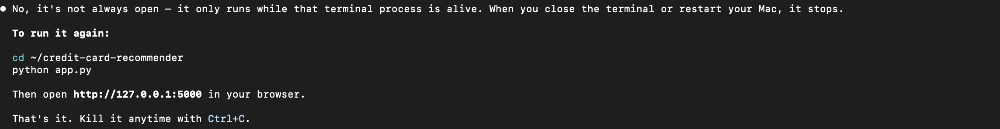

# CardMatch — Credit Card Recommender

A fintech-style web app that matches you with the best credit cards based on your spending habits and financial profile. Built with Python and Flask, deployed on Render.

**Live Demo:** https://credit-card-recs.onrender.com



## Features

- **Two-step wizard** — enter your income, credit score, and monthly spending across 7 categories
- **20 real credit cards** — Chase, Amex, Capital One, Citi, BofA, Discover, Wells Fargo, Apple
- **Smart eligibility filtering** — cards shown only if you meet income and credit score requirements
- **Ranked recommendations** — sorted by estimated first-year value (rewards + signup bonus − annual fee)
- **Side-by-side comparison** — select 2–3 cards to compare rates, fees, and value in a modal table
- **Sort & filter** — sort by first-year value, ongoing value, lowest fee, or highest bonus; filter to no-fee cards only
- **Direct apply links** — every card links to the official issuer application page
- **CSS card visuals** — each card rendered with accurate issuer colors and gradients

## How It Works

1. Enter your age, income range, and credit score tier
2. Enter your average monthly spending across dining, groceries, gas, travel, streaming, shopping, and other
3. The app filters cards by eligibility and ranks them by estimated annual value
4. Browse your top 5 matches with reward breakdowns, perks, and first-year vs. ongoing value

## Tech Stack

- **Backend:** Python, Flask
- **Frontend:** Vanilla HTML/CSS/JS (no frameworks), Jinja2 templates
- **Data:** Static card database (`cards_database.py`) with 20 cards
- **Deployment:** Render (free tier)

## Run Locally

```bash
pip install -r requirements.txt
python app.py
```

Then open `http://localhost:5000` in your browser.

## Disclaimer

I built this project for educational and portfolio purposes. I am not a financial advisor and do not receive compensation from any card issuers. All card information is subject to change — please verify current terms on the issuer's official website before applying.
